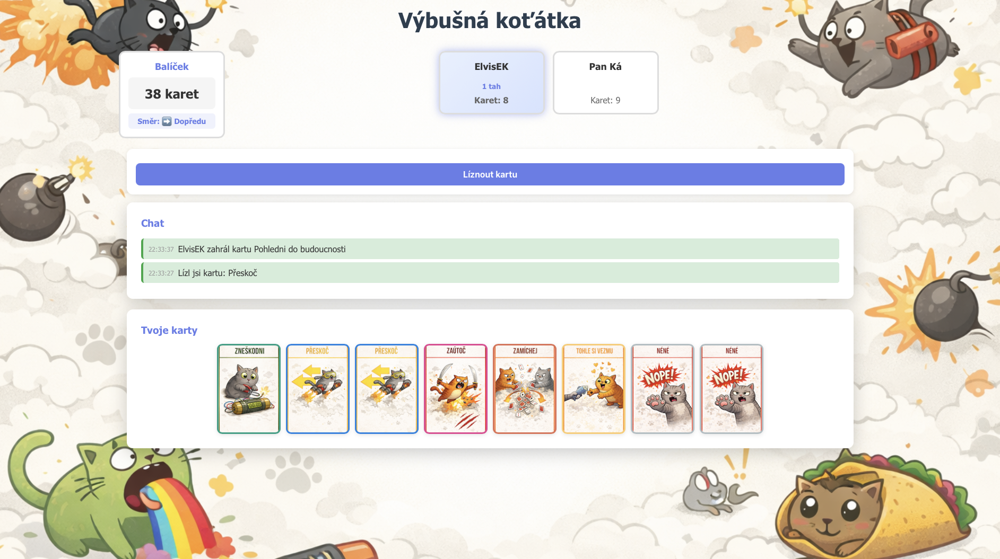

# Výbušná koťátka

Online webová hra inspirovaná hrou "Výbušná koťátka" (Exploding Kittens) - single-lobby MVP verze.

## 📋 Popis

Jednoduchá online hra pro 2-5 hráčů, kde se všichni hráči připojují do jednoho společného lobby. Hra běží v reálném čase pomocí WebSocket komunikace.



## ✨ Funkce

- ✅ Přihlášení hráčů do lobby (max 5 hráčů)
- ✅ Ready mechanika - hra začne automaticky, když jsou všichni připraveni
- ✅ Realtime herní komunikace přes WebSocket
- ✅ Všechny základní karty (Zneškodni, Přeskoč, Zaútoč, Zamíchej, Pohledni do budoucnosti, Tohle si vezmu, Nené)
- ✅ Automatické spuštění hry při připravenosti všech hráčů
- ✅ Auto-reset lobby po 60 sekundách, pokud je prázdná
- ✅ Reconnect funkcionalita pomocí tokenu
- ✅ Blokování nových hráčů během probíhající hry (reconnect stále funguje)
- ✅ Responzivní design pro mobilní zařízení (iPhone, Android)
- ✅ Touch-friendly ovládání
- ✅ Chat s časem hraní a barevnými zprávami
- ✅ Zvukové efekty
- ✅ Karty seřazené podle typu v ruce hráče
- ✅ Zobrazení počtu tahů u jména hráče

## 📖 Použití

### Základní workflow

1. **Připojení**: Zadejte své jméno a klikněte na "Připojit se"
2. **Lobby**: Počkejte na další hráče (minimálně 2, maximálně 5)
3. **Připravenost**: Klikněte na "Připraven" když jste připraveni začít
4. **Hraní**:
   - Hrajte karty z ruky kliknutím na ně
   - Lízejte kartu z balíčku, pokud nemáte co hrát
   - Cíl: Přežít jako poslední živý hráč
5. **Konec hry**: Po dokončení hry můžete začít novou hru pomocí tlačítka "Začít novou hru"

### Herní pravidla

#### Karty

- **Výbušné koťátko**: Pokud si ho lízneš a nemáš Zneškodni, okamžitě končíš (vypadáváš ze hry). Výbušné koťátko se do balíčku už nevrací.
- **Zneškodni**: Zabrání výbuchu Výbušného koťátka. Zneškodni se odebere z ruky a Výbušné koťátko se vloží zpět do balíčku **na náhodnou pozici**
- **Přeskoč**: Okamžitě ukončíš svůj tah bez lízání
- **Zaútoč**: Tvůj tah končí a další hráč má **+1 tah navíc** (tj. bude hrát 2 tahy celkem, pokud měl standardně 1)
- **Zamíchej**: Zamíchá dobírací balíček (globálně)
- **Pohlédni do budoucnosti**: Podívej se na několik vrchních karet balíčku (výbušná koťátka se zobrazí jako "Výbušné koťátko"; při líznutí se zpracují normálně)
- **Tohle si vezmu**: Vezmeš si náhodnou kartu od jiného hráče (**nikdy ne Výbušné koťátko**)
- **Nené**: Zruší akci jiné karty (first click wins)

#### Setup

- Každý hráč začíná s **7 kartami z balíčku + 1× Zneškodni**
- Exploding Kittens: počet hráčů − 1
- Balíček je zamíchán
- Server určí prvního hráče

#### Cíl hry

Vyhrává poslední živý hráč.

## 🚀 Deployment

### Předpoklady

- Docker a Docker Compose

### Docker Compose

Aplikace je připravena pro spuštění pomocí Docker Compose. Soubor `docker-compose.yml` obsahuje veškerou potřebnou konfiguraci.

#### Spuštění

```bash
docker compose up -d --build
```

Aplikace bude dostupná na `http://localhost` (port 80 je mapován na port 8000 v kontejneru)

#### Konfigurace

Aplikace je konfigurována pomocí `docker-compose.yml`:

```yaml
services:
  vybusna-kotatka:
    # Pro vývoj použijte build:
    build:
      context: .
      dockerfile: Dockerfile
    # Pro produkci použijte image z GHCR:
    # image: ghcr.io/elvisek2020/web-exploding_kitten:latest
    container_name: vybusna-kotatka
    hostname: vybusna-kotatka
    restart: unless-stopped
    ports:
      - "80:8000"
    environment:
      - PYTHONUNBUFFERED=1
      - LOG_LEVEL=INFO  # DEBUG, INFO, WARNING, ERROR, CRITICAL
    # Pro produkci přidejte síťovou konfiguraci:
    # networks:
    #   core:
    #     ipv4_address: 172.20.0.xxx

# Pro produkci odkomentujte:
# networks:
#   core:
#     external: true
```

#### Update aplikace

```bash
docker compose pull
docker compose up -d
```

#### Rollback na konkrétní verzi

V `docker-compose.yml` změňte image tag:

```yaml
services:
  vybusna-kotatka:
    image: ghcr.io/elvisek2020/web-exploding_kitten:sha-<commit-sha>
```

### GitHub Container Registry (GHCR)

Aplikace je dostupná jako Docker image z GitHub Container Registry:

- **Latest**: `ghcr.io/elvisek2020/web-exploding_kitten:latest`
- **Konkrétní commit**: `ghcr.io/elvisek2020/web-exploding_kitten:sha-<commit-sha>`

Image je **veřejný** (public), takže není potřeba autentizace pro pull.

---

## 🔧 Technická dokumentace

### 🏗️ Architektura

Aplikace je postavena jako **real-time multiplayer hra** s následujícími charakteristikami:

- **Single-lobby systém**: Všichni hráči se připojují do jednoho společného lobby
- **WebSocket komunikace**: Veškerá real-time komunikace probíhá přes WebSocket
- **State-less frontend**: Frontend pouze zobrazuje stav přijatý ze serveru
- **Server-side validace**: Veškerá herní logika a validace probíhá na serveru
- **In-memory storage**: Všechna data jsou uložena v RAM (žádná databáze)

### Technický stack

**Backend:**

- FastAPI (Python 3.11+)
- WebSockets pro real-time komunikaci
- Uvicorn jako ASGI server
- Python logging s konfigurovatelnou úrovní

**Frontend:**

- Vanilla JavaScript (ES6+)
- HTML5 + CSS3
- WebSocket API

**Deployment:**

- Docker
- Docker Compose

### 📁 Struktura projektu

```
web-exploding_kitten/
├── app/
│   ├── __init__.py
│   ├── models.py          # Datové modely (GameSession, Player, Card)
│   ├── game_logic.py      # Herní logika
│   └── data/
│       └── decks/
│           └── base.json   # Konfigurace balíčku
├── static/
│   ├── index.html         # Hlavní HTML stránka
│   ├── style.css          # Styly
│   ├── app.js             # Frontend JavaScript
│   ├── cards/
│   │   └── placeholder/   # Placeholder pro obrázky karet
│   └── sounds/            # Zvukové soubory
│       ├── exploding_kitten.mp3  # Zvuk pro výbušné koťátko
│       └── game_end.mp3          # Zvuk pro konec hry
├── main.py                # FastAPI aplikace
├── requirements.txt       # Python závislosti
├── Dockerfile
├── docker-compose.yml
└── README.md
```

### 🔧 API dokumentace

#### WebSocket endpoint

**URL**: `ws://localhost/ws` (nebo `ws://localhost:8000/ws` při lokálním vývoji)

[Detailní popis API zpráv najdete v dokumentaci - `_docs/` nebo v kódu aplikace]

### 💻 Vývoj

#### Přidání nových funkcí

1. **Backend změny**:

   - Herní logika: `app/game_logic.py`
   - WebSocket endpoint: `main.py`
   - Datové modely: `app/models.py`
2. **Frontend změny**:

   - UI logika: `static/app.js`
   - HTML struktura: `static/index.html`
   - Styly: `static/style.css` (používejte box-style komponenty)

#### Testování

- **Multiplayer**: Otevřete aplikaci ve více prohlížečích nebo záložkách
- **Logy**: Sledujte serverové logy pomocí `docker logs vybusna-kotatka -f`

#### Debugging

- Nastavte `LOG_LEVEL=DEBUG` v `docker-compose.yml` pro detailní logy
- Server loguje všechny důležité události s timestampy
- Frontend loguje chyby do konzole prohlížeče

#### Úroveň logování (`LOG_LEVEL`)

- `DEBUG` - zobrazí všechny logy včetně detailních debug informací (vývoj)
- `INFO` - zobrazí informační logy (výchozí, vhodné pro testování)
- `WARNING` - zobrazí pouze varování a chyby (doporučeno pro produkci)
- `ERROR` - zobrazí pouze chyby (minimální logování)
- `CRITICAL` - zobrazí pouze kritické chyby

Pro produkci doporučujeme nastavit `LOG_LEVEL=WARNING` nebo `LOG_LEVEL=ERROR`.

### 🎨 UI/UX

Aplikace používá **box-style komponenty** pro konzistentní vzhled:

- Všechny komponenty mají boxový vzhled s rámečky
- Konzistentní barvy a rozestupy
- Responzivní design pro desktop i mobilní zařízení
- Touch-friendly ovládání
- Chat s časem hraní a barevnými zprávami
- Karty zobrazují pouze název - popis se zobrazí při najetí myši (desktop) nebo dlouhém tapu (mobil)

### 📚 Další zdroje

- [FastAPI dokumentace](https://fastapi.tiangolo.com/)
- [WebSocket API](https://developer.mozilla.org/en-US/docs/Web/API/WebSocket)
- [Docker dokumentace](https://docs.docker.com/)

## 📄 Licence

Tento projekt je vytvořen pro vzdělávací účely.
