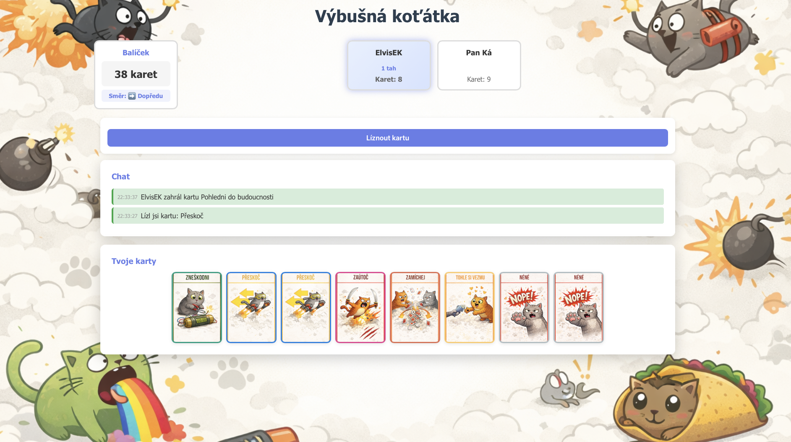

# Výbušná koťátka

Online webová hra inspirovaná hrou "Výbušná koťátka" (Exploding Kittens) - multi-lobby verze.

## 📋 Popis

Jednoduchá online hra pro 2-5 hráčů. Hráči si vybírají z herních místností (nebo si vytvoří vlastní) a hra běží v reálném čase pomocí WebSocket komunikace.



## ✨ Funkce

- ✅ Multi-lobby systém - více herních místností současně (výchozí max 10)
- ✅ Přihlášení hráčů do místnosti (2-5 hráčů)
- ✅ Ready mechanika - hra začne automaticky, když jsou všichni připraveni
- ✅ Realtime herní komunikace přes WebSocket
- ✅ Všechny základní karty (Zneškodni, Přeskoč, Zaútoč, Zamíchej, Pohledni do budoucnosti, Tohle si vezmu, Nené, Změna směru)
- ✅ Automatické spuštění hry při připravenosti všech hráčů
- ✅ Automatický úklid prázdných a neaktivních místností
- ✅ Reconnect pomocí tokenu - při výpadku spojení (reload, pád nebo zavření prohlížeče) zůstává hráč v místnosti po dobu grace period (výchozí 15 s, ostatní vidí odpočet) a po obnovení spojení se vrátí přímo do rozehrané partie. Po znovuotevření prohlížeče se rozehraná hra nabídne k obnovení
- ✅ Hráč může rozehranou hru opustit (tlačítko „Opustit hru“)
- ✅ Blokování nových hráčů během probíhající hry (reconnect stále funguje)
- ✅ Admin režim "Super Power" (`/super_power`) - zobrazení balíčku, odebrání hráče, ukončení hry, smazání místnosti
- ✅ Responzivní design pro mobilní zařízení (iPhone, Android)
- ✅ Touch-friendly ovládání
- ✅ Chat s časem hraní a barevnými zprávami
- ✅ Zvukové efekty
- ✅ Karty seřazené podle typu v ruce hráče
- ✅ Zobrazení počtu tahů u jména hráče

## 📖 Použití

### Základní workflow

1. **Připojení**: Zadejte své jméno a klikněte na "Přihlásit"
2. **Výběr místnosti**: Připojte se do existující místnosti, nebo si vytvořte vlastní
3. **Lobby**: Počkejte na další hráče (minimálně 2, maximálně 5) a klikněte na "Připraven"
4. **Hraní**:
   - Hrajte karty z ruky kliknutím na ně
   - Lízejte kartu z balíčku, pokud nemáte co hrát
   - Cíl: Přežít jako poslední živý hráč
5. **Konec hry**: Po dokončení hry můžete začít novou hru pomocí tlačítka "Začít novou hru"

### Herní pravidla

#### Karty

- **Výbušné koťátko**: Pokud si ho lízneš a nemáš Zneškodni, okamžitě končíš (vypadáváš ze hry). Výbušné koťátko se do balíčku už nevrací.
- **Zneškodni**: Zabrání výbuchu Výbušného koťátka. Zneškodni se odebere z ruky a Výbušné koťátko se vloží zpět do balíčku **na náhodnou pozici**
- **Přeskoč**: Okamžitě ukončíš svůj tah bez lízání
- **Zaútoč**: Tvůj tah končí a další hráč dostane **o 1 tah víc, než kolik jsi měl odehrát ty**. Efekt se řetězí kumulativně: pokud napadený hráč zahraje další Zaútoč, předává dál 3 tahy, další 4 atd. (záměrná odchylka od oficiálních pravidel)
- **Změna směru**: Změní směr tahu (dopředu ↔ dozadu) a ukončí tvůj tah
- **Zamíchej**: Zamíchá dobírací balíček (globálně)
- **Pohlédni do budoucnosti**: Podívej se na několik vrchních karet balíčku (výbušná koťátka se zobrazí jako "Výbušné koťátko"; při líznutí se zpracují normálně)
- **Tohle si vezmu**: Vezmeš si náhodnou kartu od jiného hráče (**nikdy ne Výbušné koťátko**)
- **Nené**: Zruší akci jiné karty (first click wins). Okno pro zrušení se zavírá líznutím další karty. Lze hrát i Nené na Nené (obnovení akce)

#### Známá omezení oproti oficiálním pravidlům

- **Kombinace karet** (2× stejná = náhodná karta od hráče, 3× stejná = vyžádání konkrétní karty, 5 různých = karta z odhazovacího balíčku) **nejsou implementované**
- **Tohle si vezmu** bere náhodnou kartu; podle oficiálních pravidel si cílový hráč vybírá, kterou kartu dá (záměrné zjednodušení)
- **Zaútoč** se řetězí kumulativně (viz výše), oficiální pravidla kumulaci nemají

#### Setup

- Každý hráč začíná s **7 kartami z balíčku + 1× Zneškodni**
- Exploding Kittens: počet hráčů − 1
- Balíček je zamíchán
- Server určí prvního hráče

#### Cíl hry

Vyhrává poslední živý hráč.

## 🚀 Deployment

### Předpoklady

- Docker a Docker Compose

### Docker Compose

Aplikace je připravena pro spuštění pomocí Docker Compose. Soubor `docker-compose.yml` obsahuje veškerou potřebnou konfiguraci.

#### Spuštění

```bash
docker compose up -d --build
```

Aplikace bude dostupná na `http://localhost:8080` (port 8080 je mapován na port 8000 v kontejneru, viz `docker-compose.yml`)

#### Admin heslo

Heslo pro admin režim Super Power se nastavuje **jen přes proměnnou prostředí** `ADMIN_PASSWORD` – v kódu žádné výchozí heslo není. Bez nastaveného hesla je admin režim vypnutý.

- **Soubor `.env`** (doporučeno): zkopírujte `.env.example` jako `.env` vedle `docker-compose.yml` a vyplňte `ADMIN_PASSWORD`. Docker Compose si ho načte automaticky; `.env` je v `.gitignore` i `.dockerignore`, takže se nedostane do repozitáře ani do image.
- **Přímo v `docker-compose.yml`**: místo `${ADMIN_PASSWORD:-}` napište heslo (pak ale soubor necommitujte).

Po 5 neúspěšných pokusech o heslo z jedné IP se admin přihlášení na 15 minut zablokuje.

#### Konfigurace (proměnné prostředí)

| Proměnná | Výchozí | Význam |
|---|---|---|
| `ADMIN_PASSWORD` | – | Heslo pro admin režim Super Power (viz výše). Nenastavené = admin režim vypnutý |
| `ADMIN_MAX_FAILED_ATTEMPTS` | `5` | Po kolika neúspěšných pokusech o admin heslo se IP zablokuje |
| `ADMIN_LOCKOUT_SECONDS` | `900` | Na jak dlouho se admin přihlášení z IP zablokuje |
| `LOG_LEVEL` | `INFO` | Úroveň logování (`DEBUG`, `INFO`, `WARNING`, `ERROR`, `CRITICAL`) |
| `ALLOWED_ORIGINS` | – | Povolené originy pro CORS a WebSocket (čárkami oddělený seznam). Nenastavené = jen stejná doména, na které hra běží (porovnává se s hlavičkou `Host`, resp. `X-Forwarded-Host`). Pokud reverse proxy hlavičku `Host` přepisuje, nastavte konkrétní doménu (např. `https://kotatka.example.com`). `*` = libovolný web |
| `TOKEN_EXPIRY_SECONDS` | `3600` | Platnost reconnect tokenu od poslední aktivity hráče (0 = bez expirace) |
| `DISCONNECT_GRACE_SECONDS` | `15` | Jak dlouho po výpadku spojení zůstává hráč v místnosti/hře (čeká se na reconnect, ostatní vidí odpočet) |
| `WS_HEARTBEAT_TIMEOUT` | `45` | Po kolika sekundách bez ping zprávy se spojení považuje za mrtvé |
| `FORWARDED_ALLOW_IPS` | `127.0.0.1` | IP reverse proxy, jejímž `X-Forwarded-For` hlavičkám server věří (nutné za proxy, jinak rate limity počítají všechny hráče jako jednu IP) |
| `MAX_CONNECTIONS_PER_IP` | `10` | Max. souběžných WebSocket spojení z jedné IP |
| `MAX_REGISTRATIONS_PER_IP` | = `MAX_CONNECTIONS_PER_IP` | Max. přihlášených hráčů z jedné IP (opuštěné registrace se uvolňují automaticky) |
| `RATE_LIMIT_PER_SECOND` | `10` | Max. zpráv za sekundu z jedné IP |
| `MAX_LOBBIES` | `10` | Max. počet místností |
| `MAX_REGISTERED_PLAYERS` | `200` | Strop registrovaných hráčů (ochrana paměti) |
| `REGISTRY_DISCONNECT_TTL` | `300` | Po kolika sekundách se uklidí registrace odpojeného hráče mimo místnost |
| `MAX_PLAYER_NAME_LENGTH` | `20` | Max. délka jména hráče |
| `MAX_LOBBY_NAME_LENGTH` | `22` | Max. délka názvu místnosti |
| `LOBBY_INACTIVITY_TIMEOUT` | `1800` | Po kolika sekundách neaktivity se místnost smaže |
| `MAX_WS_MESSAGE_SIZE` | `4096` | Max. velikost WebSocket zprávy ve znacích (uvicorn navíc odmítá zprávy nad 64 KB) |

Ukázková konfigurace je v `docker-compose.yml`. Pro produkci za reverse proxy nezapomeňte na `FORWARDED_ALLOW_IPS` (IP proxy v docker síti) a konkrétní `ALLOWED_ORIGINS`.

#### Update aplikace

```bash
docker compose pull
docker compose up -d
```

#### Rollback na konkrétní verzi

V `docker-compose.yml` změňte image tag:

```yaml
services:
  vybusna-kotatka:
    image: ghcr.io/elvisek2020/web-exploding_kitten:sha-<commit-sha>
```

### GitHub Container Registry (GHCR)

Aplikace je dostupná jako Docker image z GitHub Container Registry:

- **Latest**: `ghcr.io/elvisek2020/web-exploding_kitten:latest`
- **Konkrétní commit**: `ghcr.io/elvisek2020/web-exploding_kitten:sha-<commit-sha>`

Image je **veřejný** (public), takže není potřeba autentizace pro pull.

---

## 🔧 Technická dokumentace

### 🏗️ Architektura

Aplikace je postavena jako **real-time multiplayer hra** s následujícími charakteristikami:

- **Multi-lobby systém**: Hráči si vybírají z více herních místností, každá má vlastní herní session
- **WebSocket komunikace**: Veškerá real-time komunikace probíhá přes WebSocket
- **State-less frontend**: Frontend pouze zobrazuje stav přijatý ze serveru
- **Server-side validace**: Veškerá herní logika a validace probíhá na serveru
- **In-memory storage**: Všechna data jsou uložena v RAM (žádná databáze)
- **Reconnect s grace period**: Hráč, kterému spadne spojení, zůstává v místnosti po dobu `DISCONNECT_GRACE_SECONDS`; ostatním se zobrazuje jako "Odpojen" s odpočtem. Po návratu pokračuje ve hře, po vypršení je ze hry odstraněn. Token je uložený i v `localStorage`, takže se hráč vrátí i po zavření nebo pádu prohlížeče (pokud je hra otevřená v jiném okně, nabídne se její převzetí).
- **Soukromé informace jen dotčeným hráčům**: karty z „Pohlédni do budoucnosti“ vidí jen hráč, který kartu zahrál, ukradenou kartu jen oba zúčastnění; pořadí balíčku se klientům neposílá.

### Technický stack

**Backend:**

- FastAPI (Python 3.11+)
- WebSockets pro real-time komunikaci
- Uvicorn jako ASGI server
- Python logging s konfigurovatelnou úrovní

**Frontend:**

- Vanilla JavaScript (ES6+)
- HTML5 + CSS3
- WebSocket API

**Deployment:**

- Docker
- Docker Compose

### 📁 Struktura projektu

```
web-exploding_kitten/
├── app/
│   ├── __init__.py
│   ├── models.py          # Datové modely (Lobby, GameSession, Player, Card)
│   ├── game_logic.py      # Herní logika
│   └── data/
│       └── decks/
│           └── base.json   # Konfigurace balíčku
├── static/
│   ├── index.html         # Hlavní HTML stránka
│   ├── super_power.html   # Admin rozhraní (Super Power)
│   ├── style.css          # Styly
│   ├── app.js             # Frontend JavaScript
│   ├── version.json       # Verze aplikace (mění se pouze ručně)
│   ├── cards/
│   │   └── placeholder/   # Placeholder pro obrázky karet
│   └── sounds/            # Zvukové soubory (mp3 + wav)
├── tests/                 # Testy (pytest) - herní logika a WebSocket server
├── main.py                # FastAPI aplikace (WebSocket endpoint, multi-lobby)
├── requirements.txt       # Python závislosti
├── requirements-dev.txt   # Závislosti pro testy
├── .env.example           # Vzor pro .env (admin heslo apod.)
├── Dockerfile
├── docker-compose.yml
└── README.md
```

### 🔧 API dokumentace

#### WebSocket endpoint

**URL**: `ws://localhost/ws` (nebo `ws://localhost:8000/ws` při lokálním vývoji)

[Detailní popis API zpráv najdete v dokumentaci - `_docs/` nebo v kódu aplikace]

### 💻 Vývoj

#### Přidání nových funkcí

1. **Backend změny**:

   - Herní logika: `app/game_logic.py`
   - WebSocket endpoint: `main.py`
   - Datové modely: `app/models.py`
2. **Frontend změny**:

   - UI logika: `static/app.js`
   - HTML struktura: `static/index.html`
   - Styly: `static/style.css` (používejte box-style komponenty)

#### Testování

- **Automatické testy** (herní logika + WebSocket server):

  ```bash
  pip install -r requirements.txt -r requirements-dev.txt
  pytest
  ```

  Testy běží i v GitHub Actions – při push do `main` se Docker image sestaví jen když testy projdou.
- **Multiplayer**: Otevřete aplikaci ve více prohlížečích nebo anonymních oknech (nová záložka téhož prohlížeče nabídne převzetí už přihlášeného hráče – zvolte „Nový hráč“)
- **Logy**: Sledujte serverové logy pomocí `docker logs vybusna-kotatka -f`

#### Debugging

- Nastavte `LOG_LEVEL=DEBUG` v `docker-compose.yml` pro detailní logy
- Server loguje všechny důležité události s timestampy
- Frontend loguje chyby do konzole prohlížeče

#### Úroveň logování (`LOG_LEVEL`)

- `DEBUG` - zobrazí všechny logy včetně detailních debug informací (vývoj)
- `INFO` - zobrazí informační logy (výchozí, vhodné pro testování)
- `WARNING` - zobrazí pouze varování a chyby (doporučeno pro produkci)
- `ERROR` - zobrazí pouze chyby (minimální logování)
- `CRITICAL` - zobrazí pouze kritické chyby

Pro produkci doporučujeme nastavit `LOG_LEVEL=WARNING` nebo `LOG_LEVEL=ERROR`.

### 🎨 UI/UX

Aplikace používá **box-style komponenty** pro konzistentní vzhled:

- Všechny komponenty mají boxový vzhled s rámečky
- Konzistentní barvy a rozestupy
- Responzivní design pro desktop i mobilní zařízení
- Touch-friendly ovládání
- Chat s časem hraní a barevnými zprávami
- Karty zobrazují pouze název - popis se zobrazí při najetí myši (desktop) nebo dlouhém tapu (mobil)

### 📚 Další zdroje

- [FastAPI dokumentace](https://fastapi.tiangolo.com/)
- [WebSocket API](https://developer.mozilla.org/en-US/docs/Web/API/WebSocket)
- [Docker dokumentace](https://docs.docker.com/)

## 📄 Licence

Tento projekt je vytvořen pro vzdělávací účely.
